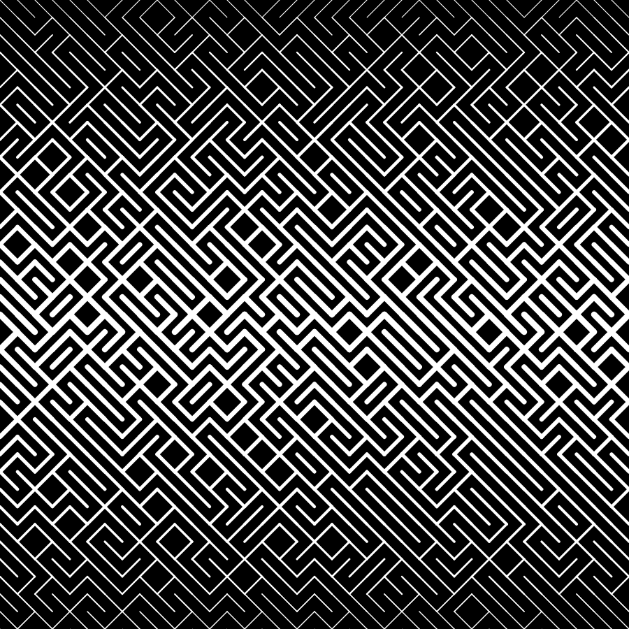

# Creative Coding (NYUx DMEDX6063) on EdX

## [Link to the course](https://www.edx.org/course/creative-coding)

>## Course description
This course is a graduate-level, introductory creative programming course, appropriate for students with no prior programming experience. Traditionally, introductory programming teaches algorithmic problem-solving, and scalable engineering, where a sequence of instructions describe the steps necessary to achieve a desired result. In Creative Coding, students are trained to go beyond sequential problem solving and to use the computer as a creative medium for art, games, and graphic design. This course will introduce you to a variety of concepts in programming, and how they can be applied creatively to work in a variety of media, such as 2D graphics, animation, image and video processing. A strong focus will be on creating interactive experiences for the web. By the end of this course, students will be empowered to read and write javascript for creative applications, as well as walk away with a portfolio-ready final project.

### [Syllabus can be found here](/syllabus.md) or on the course page.

## Platform: Javascript using the library [p5.js](p5js.org)
----
>### Some reference notes
- [Week - 1](Week-1/readme.md)
- [Week - 2](Week-2/readme.md)
----

### Week 1 assignment - Create walls like it is showcased on [Solving Sol](solvingsol.com)

Some solutions [More solutions here](week1_HW_solvingsol/readme.md)

  
  
  
  
  
  
  

----
### Week 2 assignment - Geometric Abstrcation

Some solutions [More here](week2_HW_GeometryAbstraction/readme.md)

  
