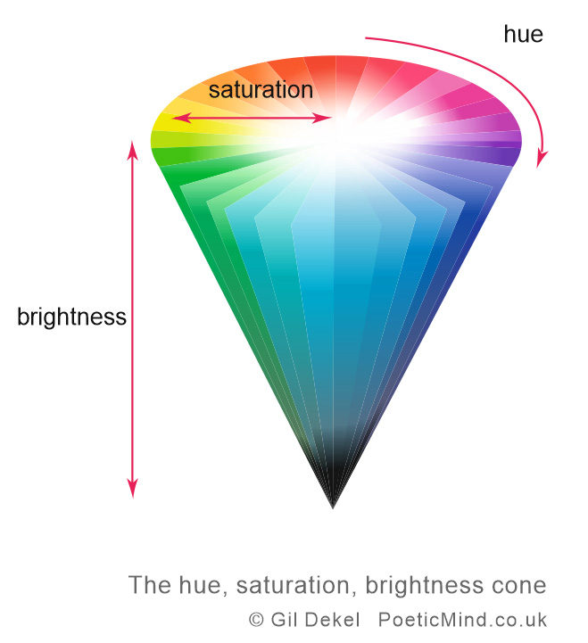
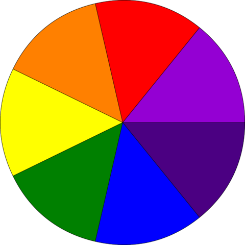
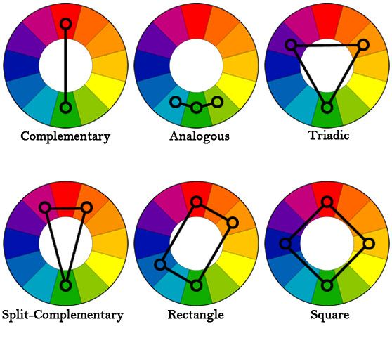

==============
Week 4 - Color
==============

This week is all about color and how to use color in P5js.

4.2 Colored Light
=================

+ lowest visible frequency ⟸ red ⟹ longest wave length
+ highest visible frequency ⟸ violet ⟹ shortest wave length
+ White is even (uniform) distribution of color
+ Black is absence of Light

- Subtractive color ⟶ mixing color pigments ⟶ dark brown/Black
- Additive color ⟶ mixing colored light ⟶ approaches white

color
-----
.. code-block:: javascript

    color(red,green,blue);

- color takes 3 parameters ⟶ red channel, green channel, blue channel
  
.. image:: ../assets/rgb-colorspace.jpg
    :alt: RGB color
    :width: 50%
    :align: center
    
.. code-block:: javascript

    //color can also be specified in the following ways

    // numbers
    var c = color(255,0,0);
    // strings
    var c = color("rgb(100%,0%,0%)");
    // hexadecimal
    var c = color("#ff0000");

fill value
----------
.. code-block:: javascript

    fill(255,0,0);  ⟶ RED fill color
    fill(0,255,0);  ⟶ GREEN fill color
    fill(0,0,255);  ⟶ BLUE fill color

4.3 Hue, Saturation and Brightness
==================================
- In p5js we can specify color representation mode to be *HSB* by calling color mode.
  
.. code-block:: javascript

    colorMode(HSB,Hue,Saturation,Brightness);

Representation of colors in HSB mode.
-------------------------------------
  

.. note::

    In practice, the default maximum values of H,S, and B are as follows

    - Hue = 360
    - Saturation = 100
    - Brightness = 100

    Brightness is also frequently referred to as *"Luminance"*.
  
4.4 Color Wheels
================
This a representation of color in a graphical format

- 1666 ⟶ Science Boi Issac Newton ⟶ Dispersion ⟶ Color deconstruction with prism
- Color Wheel
    - 7 asymmetrical segments.
    - Arranged complementary colors opposite to each other in a circle.
    - Each side enhanced the other through optical contrast.

- FunFact: He did this with musical notes as well to suggest that like music colors could harmonize with each other (I don't get either!)

Color Harmonies
---------------
+-------------+-----------+
| |cool-warm| | |harmony| |
+-------------+-----------+

.. |cool-warm| image:: ../assets/cold-warm.png
    :width: 100%

- Hue is the representation of the angle along the color wheel
- Numerically Analogous colors are less than 30 degrees

4.5 Beautiful Randomness
------------------------
Note:
~~~~~
Function keyPressed() in p5js constantly listens for a key press. If a key is pressed, then the code in the functions is executed.

More on this at `keyPressed <https://p5js.org/reference/#/p5/keyPressed>`_

.. code-block:: javascript

    /* This function is constantly listening for key press
    If the pressed key is SPACEBAR (code ==> 32) new hue is computed and draw is called again.
    */
    function keyPressed() {
        if (keyCode == 32) {
        // Code here is executed upon key press.
        }
    }

4.6 Color Interpolation
-----------------------
Interpolation is a way creating a gradient between different values. It is transitioning from one color to another.

- One way of doing this is using the lerpColor() function in p5js.
- lerpColor() -bBlends two colors to find a third color somewhere between them. 
- More on this at `lerpColor <https://p5js.org/reference/#/p5/lerpColor>`_

.. code-block:: javascript

    lerpColor(colorFrom, colorTo, lerpAmount);

    // 0 > lerpAmount > 1.0

- Map function maps a value of a variable from one range to another.
- More on this at `map <https://p5js.org/reference/#/p5/map>`_

.. code-block:: javascript

    var mappedValue = map(variable,inputMin,inputMax,outputMin,outputMax);