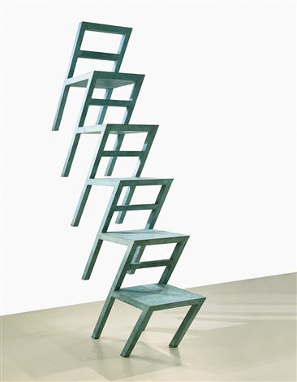
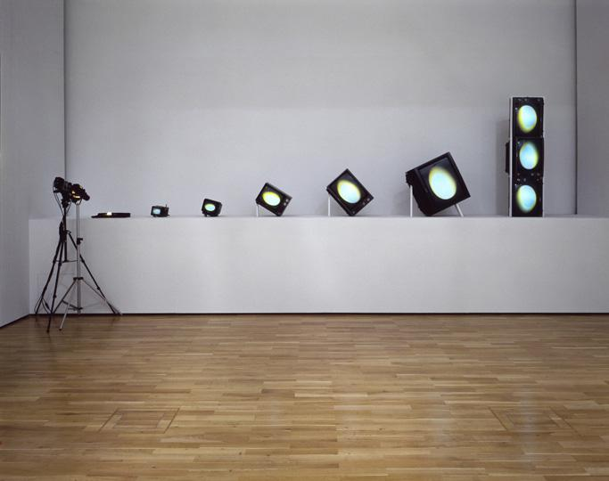
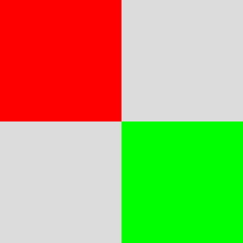

===============
Transformations
===============
In this week, the topics covered are transformations.
Transformation is of following types.
- Translations - moving origin from one point to another
- Rotation - Rotation about a origin point or an axis
- Scale - Changing the size of an object in various dimensions

6.2 Transformation
==================

Examples of transformations in art
----------------------------------
1. Transformation - 20b by Lucas Samaras (Left) ⟶ Translation
2. Egg Grows by Nam June Paik (Right) ⟶ Translates, rotates and scales.
   
+---------------------+---------------------+
| |Transformation20b| |      |EggGrows|     |
+---------------------+---------------------+

Transformation functions in P5js
--------------------------------
- Translate ⟶ moves canvas origin point to x and y values

.. code-block:: javascript

    translate(x, y);

- Rotate ⟶ rotates next draw call by an angle in radians

.. code-block:: javascript

    rotate(angle);

- Scale ⟶ scales the next draw call by a numerical factor greater than zero.
- The scale factor less than one scales down the drawing and greater than 1 scales up the drawing

.. code-block:: javascript

    scale(x,y); // x ⟶ scale factor in x axis, y ⟶ scale factor in y axis

6.3 Translations
================
Example

- Note: both red and green rectangles have same (0,0) coordinates. But the translate is called with the values (width/2, height/2).

.. code-block:: javascript

    function setup() {
        createCanvas(400, 400);
    }

    function draw() {
        background(220);
        noStroke();

        // Draw Rectangle 1
        fill(255, 0, 0);
        rect(0, 0, width / 2, height / 2);

        // Translate origin from top left to the center of the canvas
        translate(width / 2, height / 2);

        // Draw Rectangle 2
        fill(0, 255, 0);
        rect(0, 0, width / 2, height / 2);
    }

- Results in...

- Functions push() and pop() isolates the transformation to only the code between them. See code below

.. code-block:: javascript

    //execute code
    push();
    // do transformations
    // execute code
    pop();
    // execute code

- The transformations done is only limited to d code written between push and pop functions.

6.4 Rotations
=============

Rotation angle in P5.js is measured in radians ⟶ (0, TWO_PI) instead of degrees ⟶ (0,360).

The conversion between radians and degrees can be done using the following functions.

.. code-block:: javascript

    // Radians ⟶ Degrees
    var xDegrees = degrees(angle_in_radians);

    // Degrees ⟶ Radians
    var xRadians = radians(angle_in_degrees);

To set the default unit of measurement for angles, the function angleMode() can be used.

.. code-block:: javascript

    // For Degrees

    setup(){
        createCanvas(400,400);
        angleMode(DEGREES);
    }

    // For Radians ⟶ This set by default so, its not required to specify for radians

    setup(){
        createCanvas(400,400);
        angleMode(RADIANS);
    }

Transformation Order ⟶ Translate first, rotate later (recommended order in practice)

Example for rotate()

.. code-block:: javascript

    function setup() {
        createCanvas(800, 800);
        // Set Default unit for angle
        angleMode(DEGREES);
        // Set rectangle origin to center of the rectangle
        // By default, it is at top left corner
        rectMode(CENTER);
    }

    function draw() {
        background(23);

        // translate before rotate
        translate(width / 2, height / 2);
        rotate(frameCount);

        // Rotate before translate
        /* rotate(frameCount);
        translate(width / 2, height / 2); */
        rect(0, 0, 50, 100);
    }

6.5 Scale
=========
- Scale ⟶ scales the next draw call by a numerical factor greater than zero.
- The scale factor less than one scales down the drawing and greater than 1 scales up the drawing

.. code-block:: javascript

    scale(x,y); // x ⟶ scale factor in x axis, y ⟶ scale factor in y axis

Example

.. code-block:: javascript

    function setup() {
        createCanvas(400, 400);
    }

    function draw() {
    background(255);
        var x = 0;
        while (x < 20) {
            push();
            translate(x * 20, height / 2);
            scale(x * 0.1);
            ellipse(0, 0, 10, 10);
            pop();
            x++;
        }
    }

NOTE: Explore transformations and order of transformations for a deeper understanding.

    