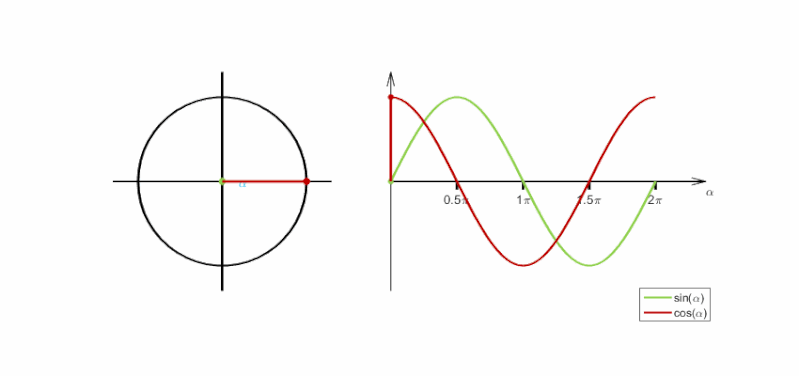

=============================
Harmonic Motion and Animation
=============================

7.1 - Harmonic Motion with noise
================================

Random on Separate Refresh
--------------------------

More control over using the using random and noise functions

Example link: `random with modulos and noise <https://openprocessing.org/sketch/412413>`_

The same example is also in the 7.1 code folder.

7.2 - Repetition & Oscillation and Linear Motion
================================================
In this section, there is discussion on two types of animation.

1. Repetition - Animation that repeats from the beginning
   - Repetition uses modulus to start from beginning
    
2. Oscillation - Animation that swings back and forth like a pendulum
   - Uses sine and cosine functions to oscillate between -1 and 1.

Examples - Repetitive motion

.. code-block:: javascript

    var x = 0;

    function setup(){
        createCanvas(400, 400);
        noStroke();
    }

    function draw(){
        background(220);
        translate(0, height/4);
        fill(255, 0, 0);
        rect(x, 0, 100, 100);
        x++;
        // Using modulo is much better than using a conditional here.
        x = x % width;
    }

- Other words to describe oscillating motion are *periodic motion* or *harmonic motion*.

Examples - oscillating motion

.. code-block:: javascript

    let yPos;
    var ySpeed = 1;
    var radius = 50;

    function setup() {
        createCanvas(400, 400);
        yPos = height / 2;
    }

    function draw() {
        background(220);
        yPos = yPos + ySpeed;
        if (yPos + radius / 2 > height || yPos - radius / 2 < 0) {
            ySpeed *= -1.0;
        }
        ellipse(width / 2, yPos, radius);
    }

7.3 Sine and Cosine
===================

Sine and cosine (waves) functions.

*Amplitude*: The maximum and minimum extents of oscillation. By default, sin() and cos() produce outputs in range -1 to 1.

*Period* (wavelength): The time taken to complete 1 oscillation. i.e., for the angle to increase from 0 to TWO_PI (radians).

Demo of sin(). Check the output of below code to see how a sine function behaves. Observe how the output value oscillates between -1 and 1.

.. code-block:: javascript

    function setup(){
        createCanvas(400, 400);
        //limits frame rate
        frameRate(10);
    }

    function draw(){
        background(255);
        var val = sin(radians(frameCount));
        console.log(val);
    }

Observe that sine and cosine are offset (out of phase) by a value of PI/2.

Example: Elastic Motion

.. code-block:: javascript

    var radius = 50;

    function setup() {
        createCanvas(400, 400);
    }

    function draw() {
        background(220);
        var amplitude = height / 2 - radius / 2; 
        // - radius/2 for cosmetics: To account for radius during bounce
        var y = sin(radians(frameCount)) * amplitude;
        translate(width / 2, height / 2);
        ellipse(0, y, radius);
    }

This is similar to example in section 7.2 Linear motion. But there are no conditional statements to check or change the direction of motion.

7.4 Inspiration for Motion Graphics
===================================

Examples

1. `mr. div <http:///mrdiv.tumblr.com/page/3>`_
2. `89-A <http://www.89a.co.uk/post/134617146812/splash>`_
3. `dvdp <https://dvdp.tumblr.com>`_
4. `The harmonic series <http://www.creativeapplications.net/processing/the-harmonic-series-device-that-explores-musical-and-visula-harmony>`_ 

Example code make the object go in a circle

.. code-block:: javascript

    var radius = 25;
    var xSpeed = 4.0;
    var angle = 0.0;

    function setup() {
        createCanvas(400, 400);
    }

    function draw() {
        background(220);
        translate(width / 2, height / 2);
        var amplitude = height / 2 - radius / 2;
        angle += 2.0;
        var x = cos(radians(angle)) * amplitude;
        var y = sin(radians(angle)) * amplitude;
        fill(100);
        ellipse(x, y, radius);
        x += xSpeed;
    }

Lissajous Curves
----------------
A Lissajous curve, also known as Lissajous figure or Bowditch curve, is the graph of a system of parametric equations x=A/sin; y=B/sin, which describe complex harmonic motion.

Wikipedia: `Lissajous Curves <https://en.wikipedia.org/wiki/Lissajous_curve>`_

Render using the code in folder /7.4

.. image:: ../assets/week-7/lissajous.gif
    :alt: Lissajous
